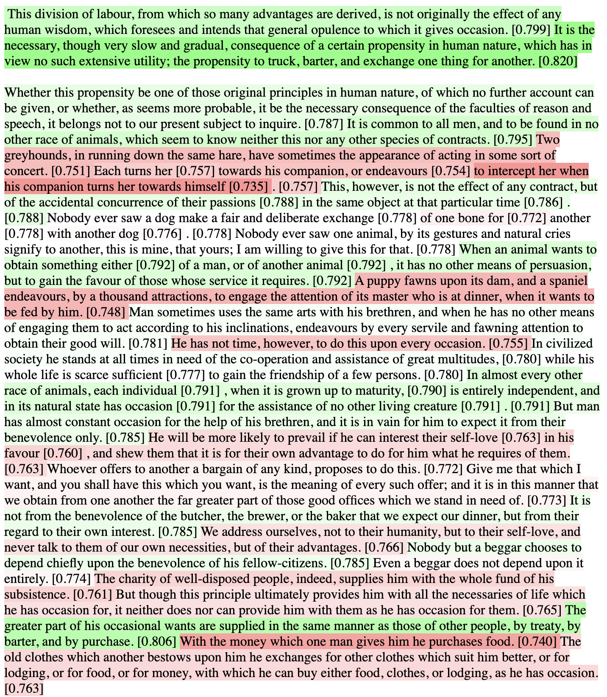

# Skimmer

A system for automatically identifiying the most important text in a document, and some tools for using that information to either highlight or abridge the text.

If want to be able to read more stuff, but you don't want to rely on an LLM summarizer (maybe you need to see the figures or equations, or maybe you just don't trust it), then this may be useful to you.

This project is a work in progress. It currently contains:
- A family of methods for scoring sentence / clause importance by finding ablations that minimize the effect on a passage's embedding vector ([embedding_scorer.py](skimmer/embedding_scorer.py)). This is relatively cheap, computationally, but inflexible.
- A family of methods for scoring sentence / clause importance by summing similarities to an LLM-generated summary of the passage ([summary_matching_scorer.py](skimmer/summary_matching_scorer.py)). This requires comparatively expensive LLM processing, but offers much more flexibility. It provides much better results, subjectively, though the difference is not reflected in the ROUGE scores (see below) in my experience so far.
- "Demo" code that uses these to set the background color of each sentence / clause. (This is for manual evaluation.)
- [rouge_eval.py](skimmer/rouge_eval.py) performs evaluations on the CNN / Daily Mail summarization dataset. These evaluations use ROUGE, which is a family of scoring metrics that measure similarity to the human-authored summaries in the dataset.
- A basic FastAPI service that uses the "summary matching" scorer to _abridge_ text by removing sentences whose importance is below a threshold.
- Of less interest:
  - [icl_abridger.ipynb](notebooks/icl_abridger.ipynb) is a quick experiment using an LLM to abridge text directly, using in-context learning. Subjectively, this does even worse than the literature (see [Zhang et al 2023](https://arxiv.org/abs/2304.04193)) led me to expect.
  - Implementations using OpenAI embeddings, and using locally-computed [Jina embeddings](https://huggingface.co/jinaai/jina-embeddings-v2-small-en). (These are both for the embedding-based scorer, which isn't as good.)

Future directions:
- Instead of just highlighting the most important points (or abridging the least important), this could be adapted to highlight the sections that are most semantically relevant to abstract queries (e.g., "What parts of this paper discuss specific differences from previous work?"). To do this, the summary-matching scorer prompt can be altered with placeholders to accommodate such queries.
- Useful front-ends, possibly including:
  - Command-line tool for highlighting PDFs.
  - Browser plugin for highlighting blog articles.

## Setup

```
python3.10 -m venv ~/.venv/skimmer
source ~/.venv/skimmer/bin/activate
pip install -r requirements.txt
```

An OpenAI API key is required for the summary-matching scorer (the good one):
```
export OPENAI_API_KEY='...'
```

## Demo
This will run the clause-level summary-based scorer on chapter 2 of Adam Smith's _Weath of Nations_. It will then open an HTML temp file in a browser to show color-coded clauses (red=remove / don't highlight, green=keep / highlight).

``` 
python -m skimmer.summary_matching_scorer_demo dev-data/gutenberg-pg3300-excerpt02-trunc.txt --method clause-summary-matching  --cache-dir /tmp/skimmer
```

The first two paragraphs of output look like this:



Note the span "importance" scores in \[square brackets\].

For a highlighting task, a score threshold will be chosen. E.g., everything above, say, the 50th percentile (i.e., some hue of green, in the output above) could be highlighted.

## ROUGE scores

```
time python -m skimmer.rouge_eval --cnn-dm-dir ~/data/cnn-dailymail --subset 0.03 --work-dir ~/data/skimmer --sweep resources/rouge-sweep-config.yaml
```

Note that that currently requires a Weights & Biases account.

## Locally test service
```
uvicorn api.fastapi_service:app --reload
```

```
curl -X POST "http://localhost:8000/score" -H  "accept: application/json" -H  "Content-Type: application/json" -d "{\"text\":\"Stocks fell today. Tech stocks led the sell-off, falling 5%. A spokesperson for Microsoft said not to worry. This person reminded us that stocks go up and down all the time. Nevertheless, Microsoft fell 10% on news that bad stuff might happen.\"}"
```

```
curl -X POST "http://localhost:8000/abridge" -H  "accept: application/json" -H  "Content-Type: application/json" -d "{\"text\":\"Stocks fell today. Tech stocks led the sell-off, falling 5%. A spokesperson for Microsoft said not to worry. This person reminded us that stocks go up and down all the time. Nevertheless, Microsoft fell 10% on news that bad stuff might happen.\", \"keep\": 0.5}"
```

